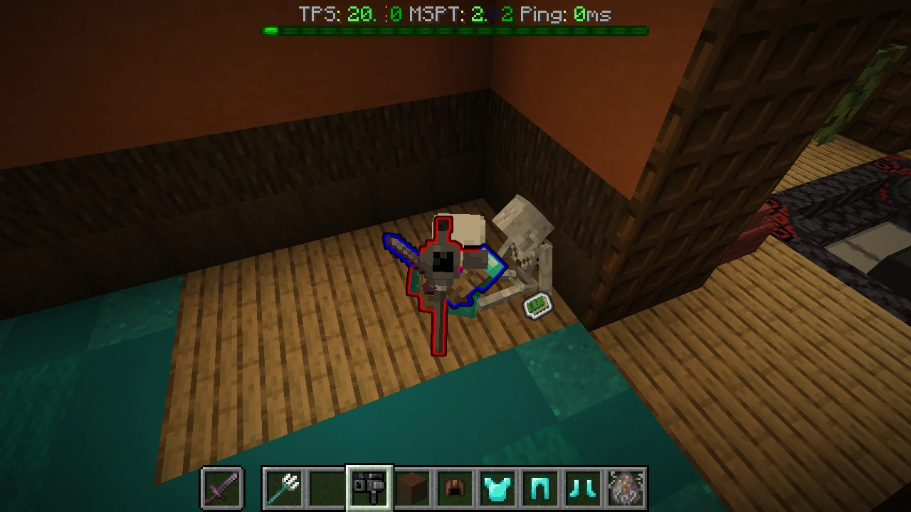

**[한국어](#한국어)** 설명은 아래에 있습니다.

# Notice

In this repository I've applied a number of changes to make the Figura mod behave the way I need it to
(integration with and control from a game server for producing video content for broadcast, replay compatibility, and so on).

Because of that, this Figura mod includes features that break the existing rules of the Figura community.
For example:
- A `netlock` command, added to keep avatars fixed in place while watching replays.
- A feature that lets you put any local avatar you choose on other players.

So please don't casually use this mod, or redistribute and share it.
It's meant for people who can analyze and understand the code — please use it or refer to it only if that's you.

I made this repository public simply because I thought sharing it might be nice.
After all, I'm just one of many Figura users, and I figured good things are worth sharing. :)
That said, if the Figura team asks me to take this repository down, I will.

A little aside — did you know?
According to Pew Research Center, 50% of Americans say they are more concerned than excited about AI,
while only 16% of South Koreans say the same.
Ha, I'm Korean myself, and I have to admit I'm pretty optimistic about AI.
Anyway, I asked the AI to document as transparently as possible where and how this fork differs from the
original project, so you'll find the changes listed below.
I don't think the AI wrote sloppy or potentially dangerous code, but just in case,
please be sure to review everything carefully yourself.

---

# MCmod_Figura_quadaFork

> An **AI-assisted fork** of [Figura](https://github.com/FiguraMC/Figura) for Minecraft **1.21.8 (Fabric)**.
> It brings the Figura 0.1.6 features to 1.21.8 and adds an **FSB (Figura Server Backend) client** — the server you are
> connected to relays avatars — along with replay support, client-side selectors, per-part glow and **server-owned states** (`server_data`).

> ⚠ **This is an unofficial fork** and is not affiliated with FiguraMC. Most changes were written with an AI coding
> assistant (Claude Code) and checked by the maintainer in real use. Before reporting a problem to upstream Figura,
> please make sure it is not caused by this fork.

## At a glance

| Item | Value |
|---|---|
| Minecraft | 1.21.8 |
| Loader | Fabric only (the Forge and NeoForge modules are excluded from the build) |
| Java | 21 |
| Mod version | `0.1.6-but-ai-edited.1` — a pre-release tag added to tell it apart from upstream 0.1.6 (see 11) |
| Based on | A 1.21.8 port of Figura 0.1.5, plus the Figura 0.1.6 (MC 1.21.4) features ported over |
| Companion server plugin | [MCplugin_FiguraFSB_quadaFork](https://github.com/kwangsoo-assemble/MCplugin_FiguraFSB_quadaFork) — **not wire-compatible with the official FSB** |
| Companion state & signal plugin | [MCplugin_FiguraController](https://github.com/kwangsoo-assemble/MCplugin_FiguraController) — server-owned states and signals (see 15) |

## Changes from upstream

Compared against upstream branch `1.21.8` at [`19195ab`](https://github.com/FiguraMC/Figura/commit/19195ab98ae71f76957fdaf95156781daad728ca).
The **Code** paths under each item are relative to `common/src/main/java/org/figuramc/figura/`, except those starting
with `fabric/` or `server-common/`, which are relative to the repository root. **(new)** marks files that upstream does not have.

### 1. Figura 0.1.6 features ported

Features added on upstream branch `0.1.6-dev/1.21.4` (MC 1.21.4) are carried over to 1.21.8.

- Updated settings and language entries
- Lua quality-of-life — the vector `__div` metamethod is static, clearer operator error messages
- `PermissivePath` — an OS-independent path implementation for resolving script and resource paths inside avatars
- Badge system
- **Rewritten Blockbench parser** (`BlockbenchParser2`) — V4 and V5 formats, lazily compiled keyframes
- Small upstream fixes that came along — the sign of the 2×2 matrix inverse, the environment argument of Lua `load()`,
  sizes shown in KiB, the error message for malformed links, Blockbench export format 4.10, and clearing a player's
  avatar when they join so it is fetched fresh
- 1.21.8 API changes — NBT getters returning `Optional` (`getXxxOr`), `ResourceLocation.fromNamespaceAndPath`,
  and the common `Minecraft.disconnect(Screen, boolean)` entry point

Code: `parsers/BlockbenchParser2.java` and 5 more new files in `parsers/` (the old `BlockbenchModel` and
`BlockbenchModelParser` are removed) · `animation/Keyframe.java` · `utils/PermissivePath.java` (new) ·
`commands/BadgeCommand.java` (new) · `lua/LuaTypeManager.java` · `math/` · `mixin/PlayerSocialManagerMixin.java` (new)

### 2. FSB (Figura Server Backend) client

Instead of the official cloud, **the server you are connected to relays avatar uploads, downloads and pings**.
The implementation from the official Figura repository's 1.20.6 branch (the diff against `35d1b591`, the last commit
before FSB) is ported to 1.21.8.

- Choosing where to upload — `Destination` (`BACKEND`, `FSB`, `BOTH`, `FSB_OR_BACKEND`)
- Upload and delete entries in the Wardrobe right-click menu
- FSB connection state in the status bar, and an FSB checkbox in the server edit screen
- Lua — the `server_packets` global (avatar scripts and server plugins exchange packets), plus
  `client:fsbConnected()`, `client:pingRateLimit()` and `client:pingSizeLimit()`
- The `server-common/` module — the shared FSB protocol. It is **the same source** as the companion server plugin

Code: `backend2/FSB.java` · `server/` · `lua/api/ServerPacketsAPI.java` (all new) · `backend2/NetworkStuff.java` ·
`gui/screens/WardrobeScreen.java` · `gui/widgets/StatusWidget.java` · `mixin/gui/EditServerScreenMixin.java` (new) ·
`mixin/ServerDataMixin.java` (new) · `lua/api/ClientAPI.java` · `fabric/…/backend2/` (new) · `server-common/` (new)

### 3. Server packets for other players' avatars (protocol change)

`CustomFSBPacket` gains an `avatarOwner` UUID. Upstream only lets the host (your own avatar) use `server_packets`;
now **other players' avatar scripts** can exchange packets with the server too.

- ⚠ Because of this change the fork is **not wire-compatible** with the official FSB server or client. Use it together
  with the companion server plugin.
- The server decides whether to allow it — server setting `allowNonHostPackets` (off by default).

Code: `server-common/…/packets/CustomFSBPacket.java` · `lua/api/ServerPacketsAPI.java` ·
`server/packets/handlers/s2c/S2CCustomFSBPacketHandler.java`

### 4. Flashback replay support

While watching a [Flashback](https://modrinth.com/mod/flashback) replay, recorded FSB server packets are still
delivered to avatars.

- An optional dependency attached through reflection. Everything works without Flashback.
- Server packets are handled when `connected() || isInReplay()`.

Code: `compat/FlashbackCompat.java` (new) · `backend2/FSB.java` · `server/packets/handlers/s2c/ConnectedPacketHandler.java`

### 5. FSB avatar distribution fixes

- The origin of an avatar hash is passed explicitly as an `AvatarSource` enum. Previously an FSB hash could be looked
  up on the official cloud and the answer cached under the FSB hash name, which **brought old avatars back**.
- The cache is split by origin (official cache file names are unchanged, so existing caches are kept).
- Two missing `return`s in `FSB.acceptDataChunk` are fixed.
- Added a receiver for the `s2c/stream/init` packet the server sends ahead of every avatar stream. Upstream had no receiver
  for it, so every avatar download logged an `Unknown custom packet payload` warning (delivery was never affected — the new
  receiver only accepts the packet).

Code: `avatar/AvatarSource.java` (new) · `avatar/UserData.java` · `avatar/local/CacheAvatarLoader.java` ·
`backend2/NetworkStuff.java` · `backend2/FSB.java` · `server/packets/handlers/s2c/S2CInitializeAvatarStreamPacketHandler.java` (new) ·
`server/packets/handlers/s2c/Handlers.java`

### 6. Per-part vanilla glow (outline)

- Model part Lua methods `setGlow(bool)` and `setGlowColor(r, g, b)`, with getters `getGlow()` and `getGlowColor()` —
  `nil` follows the parent, a value overrides it (values are not multiplied together).
- Vanilla armor and items attached to a glowing part glow with it.
- In first person, the held item is drawn at the avatar's pivot (first-person armor is not supported yet).



*Each part can have its own glow color (red, blue), and vanilla items held by a part glow in that part's color.*

Code: `model/FiguraModelPart.java` · `model/PartCustomization.java` · `model/rendering/` · `utils/RenderUtils.java` ·
`avatar/Avatar.java` · `mixin/render/` (level renderer, layer and held-item mixins) · `fabric/…/mixin/fabric/` (armor and level renderer mixins)

### 7. First-person rendering fixes

- Fixed `partToWorldMatrix()` freezing in first person for skull parts inside item displays, item frames and
  dropped items.
- In first person, hidden parts skip matrix calculation — the same behavior as third person.
- Fixed enchantment glint disappearing on parts that a shader pack draws pulled forward: the glint now gets the same
  depth rank and is pulled forward the same way. Vanilla items and armor are unaffected.

Code: `avatar/Avatar.java` · `fabric/…/mixin/fabric/LevelRendererMixinFabric.java` · `model/rendering/ImmediateAvatarRenderer.java` ·
`model/rendering/texture/RenderTypes.java`

### 8. New commands — `nonhost_load`, `nonhost_unload`, `netlock`

Put a local avatar on another player and keep it there — for cases like recording replays, where **someone else's
avatar has to stay fixed on your side**.

- `/figura nonhost_load <target> <path>` — puts a local avatar on the target and **pins** it. Cloud, FSB and websocket
  events can no longer overwrite it.
- `/figura nonhost_unload <target|all>` — removes the pin.
- `/figura netlock on|off|status` — stops loading avatars from the network entirely.
- Pins and the lock are released when you leave the world (or the replay).
- `<target>` accepts **client-side selectors** — `@s @p @r @a @e @n` with
  `[type, name, team, gamemode, distance, x, y, z, dx, dy, dz, x_rotation, y_rotation, limit, sort]`.
  Vanilla selectors are server-only and do not work in singleplayer or replays, so they are resolved from what the
  client knows (world entities, the tab list, synced teams). Conditions the client cannot know (`tag`, `scores`,
  `nbt`, …) produce an **error** instead of an empty result.
- Public API — `AvatarManager.loadLocalAvatarFor`, `unpinAvatar`, `isPinned`, `getPinnedAvatars`,
  `setNetworkLocked`, `isNetworkLocked`, `acceptsNetworkAvatar` and more.
- Hot-reload watching of local avatars now applies to the host's avatar only.

Code: `commands/NonhostLoadCommand.java` · `commands/NetlockCommand.java` · `commands/TargetArgumentType.java` ·
`utils/selector/` (all new) · `avatar/AvatarManager.java` · the network entry points that respect pins
(`avatar/UserData.java`, `backend2/`) · `mixin/MinecraftMixin.java` · `avatar/local/LocalAvatarLoader.java`

### 9. New command — `/figura reload all`

The same as the "Reload all" button in the permissions screen. It is also available as a command so that servers or
scripts can ask the client to reload.

Code: `commands/ReloadCommand.java`

### 10. UI

- The FSB connection state is shown with the same icon and color (green `+`) as the official cloud connection.

Code: `gui/widgets/StatusWidget.java`

### 11. Version number

To avoid confusion with the official 0.1.6, the version carries a [SemVer pre-release](https://semver.org/#spec-item-9) tag —
`0.1.6-but-ai-edited.1` (jar: `figura-0.1.6-but-ai-edited.1+1.21.8-fabric-mc.jar`). The last number is this fork's own release number.

- The wardrobe, F3 and `client:getFiguraVersion()` show the tagged version.
- **Comparisons** with upstream, backend and avatar versions use 0.1.6 without the tag. Under SemVer `0.1.6-…` is lower than
  `0.1.6`, so without this the official 0.1.6 would look like a newer version and trigger update notices and avatar version warnings.
- A mod that requires `figura >=0.1.6` will not accept this version (Fabric Loader compares by SemVer too) — use `>=0.1.6-` instead.

Code: root `gradle.properties` · `FiguraMod.java` (`FORK_PRERELEASE`, `COMPARE_VERSION`) · `avatar/Avatar.java` · `backend2/NetworkStuff.java` ·
`gui/screens/WardrobeScreen.java`

### 12. Mob (CEM) avatars — leak fix, new commands `/figura cem build` and `status`, full vanilla hiding, name tag hiding

Figura puts `assets/figura/cem/<ns>/<type>.nbt` from a resource pack on **every mob of that type** as an avatar (CEM).

- **Leak fix** — avatars of mobs that died or went away were never released and kept running tick and render events. The 1.21.8 client
  returns `null` for a removed entity, but the cleanup only checked `isRemoved()`. `null` now counts as gone too, and `clean()` is called
  (a mob that leaves tracking range is dropped as well, and recreated when it comes back).
- **`/figura cem build <folder>`** — compiles local avatar folders into CEM avatars. Meant for making several avatars, one per mob type, in one go.
  - `<folder>` is relative to the local avatar folder, like `/figura load`. If it has a `cem.json`, that folder is built;
    otherwise every direct subfolder that has one.
  - `cem.json` is `{"entity": "minecraft:husk"}` — one mob type or a list. If two folders name the same type, nothing is built.
  - Output goes to `figura/cem_out/<ns>/<type>.nbt` — copy it as-is under a resource pack's `assets/figura/cem/` (it never writes to a resource pack itself).
  - The written file is read back and **applied right away** — mob avatars of that type are recreated on the next render. A resource reload (F3+T) goes back to the resource pack version.
- **`/figura cem status`** — how many mob avatars are running right now, per type. Mob avatars load when first rendered and do not show up in F3, so this is how to see how many mobs actually have one.
- **Full vanilla hiding** — when a mob avatar calls `vanilla_model.ALL:setVisible(false)`, the vanilla body and **every layer** (armor, held items,
  outer clothing, head blocks, profession outfits) are not drawn. Upstream only hid the parts of humanoid models, so non-humanoid mobs such as
  villagers kept their whole body, and the drowned, stray and bogged outer clothing (layers with their own models) stayed visible too.
  Shadow, name tag and avatar parts (including the red tint when hurt) are unchanged. Player avatars are not affected.
- **Mob name tag hiding** — `nameplate.ENTITY:setVisible(false)` now works for mob avatars (upstream only checked it for players). Useful when a
  mob's custom name selects its variant and that name should not show.

Code: `avatar/AvatarManager.java` (CEM cleanup, per-type `clearCEMAvatars`) · `commands/CemCommand.java` (new) ·
`avatar/local/LocalAvatarLoader.java` (the compile inside `loadAvatar` moved out to `compileAvatarFolder`, the background queue `async` made public — same behavior) ·
`mixin/render/renderers/LivingEntityRendererMixin.java` (vanilla body and layers) · `mixin/render/renderers/EntityRendererMixin.java` (name tag)

### 13. Text task and name tag outlines

- Fixed `setOutline(true)` outlines on text tasks (`TextTask`) and name tags **not showing**. In 1.21.8 `Font` uses the alpha of the
  color it is given as is (older versions turned alpha 0 into opaque), and the outline color was passed on as the RGB from
  `setOutlineColor` (alpha 0), so the shader discarded it.
- Also fixed `setOpacity` being **ignored** on text tasks with an outline — the body color was fixed to opaque white.
- On translucent text the outline **fades faster than the text** — outline alpha = text alpha ^ 8. The outline is drawn as 8 copies
  of the text shifted by one step **under** the text, so as is, the inside of translucent glyphs would turn muddy with the outline color.
  The outline therefore only shows when the text is nearly opaque (with the vanilla shader, there is no outline at an opacity of 0.75 or less).
- See-through (`setSeeThrough(true)`) text draws its body only once, so it does not get denser from being drawn twice.

Code: `model/rendertasks/TextTask.java` · `mixin/render/renderers/EntityRendererMixin.java`

### 14. `entity:getVariable` and `world.avatarVars()` — read-only views instead of copies

These two APIs read the values other avatars publish with `avatar:store(key, value)` ("avatar variables").

- Both used to make a **recursive deep copy** of the other avatar's whole store on every call. They now return a **read-only view**
  that wraps the store without copying.
  - `entity:getVariable(key)` wraps just that slot (the whole store when no key is given); `world.avatarVars()` gives one view per avatar
  - nested tables are wrapped lazily, when read — reading one key from a store of 100,000 values: original slots read 118,007 → 2,
    allocation 3.1 MB → 1.3 KB, 1.2 ms → 73 ns (offline measurement)
- Writes (`t.x = 1`, `rawset`, `table.insert`, `setmetatable`, …) raise `table is read-only`.
- ⚠ It is a **live view**, not a snapshot: if you keep it, later changes by that avatar show through. Fetch it again after that avatar reloads.
  If the owner removes keys while you iterate it with `pairs`, `next` may raise an error.
- Bonus: the old copy overflowed the stack on cyclic tables (`a.b.a == a`). The view does not.
- Public API signatures are unchanged, so add-ons do not need to be rebuilt.

Code: `lua/ReadOnlyLuaView.java` (new) · `lua/api/entity/EntityAPI.java` · `lua/api/world/WorldAPI.java`

### 15. `server_data` — server-owned states and signals (companion: FiguraController)

The companion server plugin [MCplugin_FiguraController](https://github.com/kwangsoo-assemble/MCplugin_FiguraController) (Paper / Purpur 1.21.8, MIT) attaches states to players, mobs and a global scope.
**The core receives them and keeps them in a client-wide store outside avatars**, and every avatar — player avatars and mob (CEM) avatars alike —
reads them through the Lua global `server_data`.

- Transport: a single FSB server packet named `figuracontroller:v1` (`id` = the name's `hashCode()`); the body is a binary op stream (name dictionary,
  subject, SET, UNSET, FULL, DROP, SIGNAL, RESET). The core intercepts it **before avatars**, so nothing is lost while an avatar is not loaded yet,
  and values survive avatar reloads and mob avatars being recreated.
- The server decides who receives what — player and mob states go only to clients that are tracking the subject (and are dropped when they stop
  tracking it); global states go to everyone.
- Lua `server_data` (read-only — only the server writes; call methods with a colon `:`):
  - `server_data:get(name)`, `server_data:get(entity|uuid, name)` — the subject's own value, falling back to the **global value** · `getGlobal(name)` ·
    `getAll([entity|uuid])`
  - returned tables are **read-only** (writing raises an error); `getAll` returns a new table on every call
  - `watch(entity|uuid)`, `unwatch(…)` — also receive events for another subject (its current values arrive once as `initial` right away)
  - `send(name, data)` — a signal to the server; host player avatar only (an error from mob or other players' avatars), `false` when FSB is not connected
- Events — `server_data.STATE_CHANGED:register(fn[, name])`, or assign `function server_data.STATE_CHANGED(...)` (assignment registers too;
  names are case-insensitive, like `events`):
  - `STATE_CHANGED(name, new, old, subject, initial)` — **on the next tick, only when old ≠ new**; when an avatar loads, the current values arrive
    once with `initial = true`; `subject` is a UUID (`nil` for global)
  - `SIGNAL(name, data, subject)` — one-shot; a global signal reaches every avatar on the client
  - a global change reaches only the avatars that have no own value for that name (the ones showing the global value)
- On connect the core sends HELLO (protocol version); the server sends everything once and then only changes — there is no periodic full resend.
- **Flashback** — the whole store is written into every recording snapshot, so rewinding and skipping ahead restore the state of that moment.
- On servers without the plugin it does nothing.

Code: `serverdata/` (new) · `lua/api/ServerDataAPI.java` (new) · `mixin/compat/FlashbackRecorderMixin.java` (new) ·
`server/packets/handlers/s2c/S2CCustomFSBPacketHandler.java` (interception) · codec `kr/asmbl/figuracontroller/protocol/` (new — the original lives in the
plugin repository; the same files are copied here)

Registration of the new mixins, commands and Lua APIs, and their doc strings, live in `figura-common.mixins.json`,
`commands/FiguraCommands.java`, `lua/FiguraAPIManager.java`, `lua/docs/` and `assets/figura/lang/en_us.json`.

## Building

JDK 21 is required (newer JDKs do not work with this Gradle version).

```
./gradlew :fabric:build
```

Output: `fabric/build/libs/figura-0.1.6-but-ai-edited.1+1.21.8-fabric-mc.jar`

Build setup changes: `settings.gradle` (Fabric and `server-common` only) · `gradle.properties` (version 0.1.6-but-ai-edited.1) · `build.gradle` ·
`common/build.gradle` · `fabric/build.gradle` · `fabric.mod.json`

## Related projects

- [MCplugin_FiguraFSB_quadaFork](https://github.com/kwangsoo-assemble/MCplugin_FiguraFSB_quadaFork) —
  the companion server plugin (Paper / Purpur 1.21.8). It holds the original of `server-common/`.
- [MCplugin_FiguraController](https://github.com/kwangsoo-assemble/MCplugin_FiguraController) —
  the server-owned state & signal plugin (see 15 · Paper / Purpur 1.21.8 · MIT).
- [MCmod_SillyPlugin_quadaFork](https://github.com/kwangsoo-assemble/MCmod_SillyPlugin_quadaFork) —
  the SillyPlugin add-on built against this fork.

## License

**PolyForm Noncommercial 1.0.0**, the same as upstream (`LICENSE.md`) — noncommercial use only.
The upstream credits are in `CREDITS`, and the upstream README is kept as `README.upstream.md`.

---

# 한국어

# 안내

저는 이 레포지토리에서 피구라 모드를 제 의도대로 동작하도록 하는 여러 수정을 적용하였습니다.
(방송용 영상 콘텐츠를 제작하기 위한 서버와의 연동 및 제어, 리플레이 호환성 등)

그렇기에 이 피구라 모드는 기존 피구라 커뮤니티의 규칙을 위배하는 기능들이 추가되어 있습니다.
ex)
- 리플레이 환경에서 아바타를 고정하기 위해 추가한 netlock 명령어가 추가되어 있습니다.
- 타 플레이어에게 본인이 원하는 로컬 아바타를 착용시킬 수 있는 기능이 추가되어 있습니다.

그렇기에 이 모드를 함부로 사용하고 배포하여 공유하지 않는 것이 좋습니다.
코드를 잘 분석하고 이해할 줄 아시는 분들만 사용하거나 참고하길 바랍니다.

이 레포지토리는 그냥 공개하면 좋지 않을까 하는 생각에 공개한 것입니다.
어쨌든 저도 여러 피구라 이용자 중 하나이고, 그저 좋은 건 공유하면 좋지 않을까 하는 생각에요. :)
하지만 피구라 운영 팀에서 이 레포지토리를 내리라고 한다면 내릴 예정입니다.

아래는 사담인데요. 여러분들 그것 아시나요?
pew 리서치에 따르면 미국인의 50%가 AI를 우려한다고 답했다고 하더군요.
그런데 한국인은 16%만 AI를 우려한다고 하더군요.
하하, 사실 저도 한국인인데 AI에 대해 낙관적이긴 합니다.
아무튼, 원본 프로젝트와 비교하여 어디를 어떻게 수정하였는지 최대한 투명하게 AI가 작성하라고 시켰으니
아래에서 수정사항들을 확인할 수 있을 겁니다.
제 생각엔 AI가 코드를 어설픈 품질로 작성했다거나 위험할 수 있는 코드가 있진 않을 것이라 생각하지만
그래도 혹시 모르니 꼭 세세히 확인해 보셔야 할 것 같습니다.

---

# MCmod_Figura_quadaFork

> [Figura](https://github.com/FiguraMC/Figura) 를 **AI 도구로 수정한 포크**다 — Minecraft **1.21.8 (Fabric)** 용.
> Figura 0.1.6 기능을 1.21.8 로 옮기고, 접속한 서버가 아바타를 중계하는 **FSB(Figura Server Backend) 클라이언트**와
> 리플레이 호환 · 클라이언트 셀렉터 · 파츠별 발광 · **서버가 주인인 상태**(`server_data`) 같은 기능을 더했다.

> ⚠ **비공식 포크다.** FiguraMC 와 관련이 없다. 수정의 대부분은 AI 코딩 도구(Claude Code)로 작성했고
> 유지보수자가 실제 사용으로 확인했다. 공식 Figura 에 문제를 알리기 전에 이 포크 때문인지 먼저 확인해 달라.

## 한눈에

| 항목 | 값 |
|---|---|
| 게임 버전 | Minecraft 1.21.8 |
| 로더 | Fabric 전용 (Forge · NeoForge 모듈은 빌드에서 빠져 있다) |
| Java | 21 |
| 모드 버전 | `0.1.6-but-ai-edited.1` — 업스트림 0.1.6 과 구분하려고 붙인 프리릴리스 꼬리 (아래 11) |
| 바탕 | Figura 0.1.5 의 1.21.8 이식본 + Figura 0.1.6 (MC 1.21.4) 기능 이식 |
| 짝 서버 플러그인 | [MCplugin_FiguraFSB_quadaFork](https://github.com/kwangsoo-assemble/MCplugin_FiguraFSB_quadaFork) — **공식 FSB 와 통신 호환되지 않는다** |
| 짝 상태 · 신호 플러그인 | [MCplugin_FiguraController](https://github.com/kwangsoo-assemble/MCplugin_FiguraController) — 서버가 주인인 상태 · 신호 (아래 15) |

## 원본 대비 변경 사항

비교 기준은 원본 `1.21.8` 브랜치의 [`19195ab`](https://github.com/FiguraMC/Figura/commit/19195ab98ae71f76957fdaf95156781daad728ca) 다.
각 항목의 **코드** 경로는 `common/src/main/java/org/figuramc/figura/` 기준이고, `fabric/` · `server-common/` 으로
시작하는 것만 저장소 루트 기준이다. **(새)** 는 원본에 없던 파일이다.

### 1. Figura 0.1.6 기능 이식

원본 `0.1.6-dev/1.21.4` 브랜치(MC 1.21.4)에 들어간 기능을 1.21.8 로 옮겼다.

- 설정 · 언어 항목 갱신
- Lua 편의 기능 — 벡터 `__div` 메타메서드 정적화, 연산자 오류 메시지 개선
- `PermissivePath` — 아바타 안의 스크립트 · 리소스 경로를 운영체제와 무관하게 해석하는 경로 구현
- 뱃지 시스템
- **Blockbench 파서 재작성** (`BlockbenchParser2`) — V4 · V5 포맷 지원, 키프레임 지연 컴파일
- 함께 들어온 원본 쪽 작은 수정 — 2×2 행렬 역행렬 부호, Lua `load()` 의 환경 인자, 크기 표시 KiB,
  잘못된 링크의 오류 메시지, Blockbench 내보내기 형식 4.10, 플레이어가 들어오면 그 아바타를 비우고 새로 받기
- 1.21.8 API 대응 — NBT 게터가 `Optional` 을 돌려주는 변화(`getXxxOr`), `ResourceLocation.fromNamespaceAndPath`,
  `Minecraft.disconnect(Screen, boolean)` 공통 진입점

코드: `parsers/BlockbenchParser2.java` 와 `parsers/` 의 새 파일 5개 (옛 `BlockbenchModel` · `BlockbenchModelParser` 는 삭제) ·
`animation/Keyframe.java` · `utils/PermissivePath.java` (새) · `commands/BadgeCommand.java` (새) · `lua/LuaTypeManager.java` ·
`math/` · `mixin/PlayerSocialManagerMixin.java` (새)

### 2. FSB (Figura Server Backend) 클라이언트

공식 클라우드 대신 **접속한 서버가 아바타 업로드 · 다운로드 · 핑을 중계**한다. 공식 Figura 저장소 1.20.6 브랜치에 있던 구현
(FSB 도입 직전 커밋 `35d1b591` 과의 차이)을 1.21.8 로 옮겼다.

- 업로드 대상 선택 — `Destination` (`BACKEND` · `FSB` · `BOTH` · `FSB_OR_BACKEND`)
- 옷장(Wardrobe) 의 업로드 · 삭제 우클릭 메뉴
- 상태 표시줄에 FSB 연결 상태, 서버 편집 화면에 FSB 사용 체크박스
- Lua — `server_packets` 전역(아바타 스크립트와 서버 플러그인이 패킷을 주고받는다),
  `client:fsbConnected()` · `client:pingRateLimit()` · `client:pingSizeLimit()`
- `server-common/` 모듈 — FSB 공용 프로토콜. 짝 서버 플러그인과 **같은 소스**다

코드: `backend2/FSB.java` · `server/` · `lua/api/ServerPacketsAPI.java` (모두 새) · `backend2/NetworkStuff.java` ·
`gui/screens/WardrobeScreen.java` · `gui/widgets/StatusWidget.java` · `mixin/gui/EditServerScreenMixin.java` (새) ·
`mixin/ServerDataMixin.java` (새) · `lua/api/ClientAPI.java` · `fabric/…/backend2/` (새) · `server-common/` (새)

### 3. 다른 플레이어 아바타의 서버 패킷 (프로토콜 변경)

`CustomFSBPacket` 에 `avatarOwner` UUID 를 더했다. 원본은 호스트(자기 아바타)만 `server_packets` 를 쓸 수 있었는데,
이제 **다른 플레이어의 아바타 스크립트도** 서버와 패킷을 주고받는다.

- ⚠ 이 변경 때문에 공식 FSB 서버 · 클라이언트와 **통신 호환이 깨진다.** 짝 서버 플러그인과 함께 써야 한다.
- 허용 여부는 서버가 정한다 — 서버 설정 `allowNonHostPackets` (기본 꺼짐).

코드: `server-common/…/packets/CustomFSBPacket.java` · `lua/api/ServerPacketsAPI.java` ·
`server/packets/handlers/s2c/S2CCustomFSBPacketHandler.java`

### 4. Flashback 리플레이 호환

[Flashback](https://modrinth.com/mod/flashback) 리플레이를 볼 때도 녹화된 FSB 서버 패킷이 아바타에 전달된다.

- 리플렉션으로 붙는 선택 의존이다. Flashback 이 없어도 그대로 동작한다.
- 서버 패킷 처리 조건을 `connected() || isInReplay()` 로 넓혔다.

코드: `compat/FlashbackCompat.java` (새) · `backend2/FSB.java` · `server/packets/handlers/s2c/ConnectedPacketHandler.java`

### 5. FSB 아바타 배포 결함 수정

- 아바타 해시가 어디서 왔는지를 `AvatarSource` enum 으로 명시해 넘긴다. 예전에는 FSB 해시로 공식 클라우드를 조회하고
  그 응답을 FSB 해시 이름으로 캐시해 **옛 아바타가 되살아나는** 일이 있었다.
- 캐시를 출처별로 나눴다 (공식 캐시 파일 이름은 그대로라 기존 캐시가 유지된다).
- `FSB.acceptDataChunk` 에서 빠져 있던 `return` 두 곳을 고쳤다.
- 서버가 아바타 스트림마다 먼저 보내는 `s2c/stream/init` 패킷의 수신기를 넣었다. 원본은 이 패킷을 받는 곳이 없어서
  아바타를 받을 때마다 로그에 `Unknown custom packet payload` 경고가 찍혔다(아바타 전달에는 영향이 없었다 — 새 수신기도 받기만 한다).

코드: `avatar/AvatarSource.java` (새) · `avatar/UserData.java` · `avatar/local/CacheAvatarLoader.java` ·
`backend2/NetworkStuff.java` · `backend2/FSB.java` · `server/packets/handlers/s2c/S2CInitializeAvatarStreamPacketHandler.java` (새) ·
`server/packets/handlers/s2c/Handlers.java`

### 6. 파츠별 바닐라 발광 (아웃라인)

- 모델 파츠 Lua 메서드 `setGlow(bool)` · `setGlowColor(r, g, b)` 와 게터 `getGlow()` · `getGlowColor()` —
  `nil` 이면 부모를 따르고, 값을 주면 덮어쓴다(곱해서 누적하지 않는다).
- 발광을 켠 파츠에 붙은 바닐라 갑옷 · 아이템도 같이 빛난다.
- 1인칭에서 손에 든 아이템을 아바타 피벗 자리에 그린다 (1인칭 갑옷은 아직 안 된다).


*파츠마다 발광색을 따로 줄 수 있고(빨강 · 파랑), 손에 든 바닐라 아이템도 그 파츠의 색으로 빛난다.*

코드: `model/FiguraModelPart.java` · `model/PartCustomization.java` · `model/rendering/` · `utils/RenderUtils.java` ·
`avatar/Avatar.java` · `mixin/render/` (월드 렌더 · 레이어 · 손 아이템 믹스인) · `fabric/…/mixin/fabric/` (갑옷 · 월드 렌더 믹스인)

### 7. 1인칭 렌더 수정

- 1인칭에서 아이템 디스플레이 · 아이템 액자 · 떨어진 아이템 속 스컬 파츠의 `partToWorldMatrix()` 가 멈추던 문제를 고쳤다.
- 1인칭에서 숨긴 파츠는 행렬 계산을 건너뛴다 — 3인칭과 같은 동작이다.
- 셰이더팩이 앞으로 당겨 그리는 파츠에서 인챈트 반짝임(glint)이 사라지던 문제를 고쳤다 — 반짝임에도 같은 깊이 순위를
  넘겨 같은 식으로 당긴다. 바닐라 아이템 · 갑옷에는 영향이 없다.

코드: `avatar/Avatar.java` · `fabric/…/mixin/fabric/LevelRendererMixinFabric.java` · `model/rendering/ImmediateAvatarRenderer.java` ·
`model/rendering/texture/RenderTypes.java`

### 8. 새 명령 — `nonhost_load` · `nonhost_unload` · `netlock`

다른 플레이어에게 로컬 아바타를 입혀 두는 기능이다. 리플레이 촬영처럼 **남의 아바타를 내 쪽에서 고정**해야 할 때 쓴다.

- `/figura nonhost_load <대상> <경로>` — 대상에게 로컬 아바타를 입히고 **고정(pin)** 한다.
  클라우드 · FSB · 웹소켓 이벤트가 나중에 덮어쓰지 못한다.
- `/figura nonhost_unload <대상|all>` — 고정을 푼다.
- `/figura netlock on|off|status` — 네트워크로 오는 아바타 로딩을 통째로 멈춘다.
- 고정과 잠금은 월드(또는 리플레이)를 나갈 때 풀린다.
- `<대상>` 에 **클라이언트 셀렉터**를 쓸 수 있다 — `@s @p @r @a @e @n` 과
  `[type, name, team, gamemode, distance, x, y, z, dx, dy, dz, x_rotation, y_rotation, limit, sort]`.
  바닐라 셀렉터는 서버 전용이라 싱글플레이 · 리플레이에서 못 쓰므로, 클라이언트가 아는 정보(월드 엔티티 · 탭 목록 ·
  동기화된 팀)로 푼다. 클라이언트가 알 수 없는 조건(`tag` · `scores` · `nbt` 등)은 빈 결과 대신 **오류**를 낸다.
- 공개 API — `AvatarManager.loadLocalAvatarFor` · `unpinAvatar` · `isPinned` · `getPinnedAvatars` ·
  `setNetworkLocked` · `isNetworkLocked` · `acceptsNetworkAvatar` 등.
- 로컬 아바타 핫리로드 감시는 이제 호스트 아바타만 한다.

코드: `commands/NonhostLoadCommand.java` · `commands/NetlockCommand.java` · `commands/TargetArgumentType.java` ·
`utils/selector/` (모두 새) · `avatar/AvatarManager.java` · 고정을 지키는 네트워크 진입점(`avatar/UserData.java` · `backend2/`) ·
`mixin/MinecraftMixin.java` · `avatar/local/LocalAvatarLoader.java`

### 9. 새 명령 — `/figura reload all`

권한 화면의 «모두 다시 불러오기» 버튼과 같은 동작이다. 서버나 스크립트가 클라이언트에 리로드를 시킬 수 있도록 명령으로도 냈다.

코드: `commands/ReloadCommand.java`

### 10. UI

- FSB 연결 상태를 공식 클라우드 연결과 같은 모양 · 색(초록 `+`)으로 보여 준다.

코드: `gui/widgets/StatusWidget.java`

### 11. 버전 표기

공식 0.1.6 과 헷갈리지 않도록 버전에 [SemVer 프리릴리스](https://semver.org/#spec-item-9) 꼬리를 붙였다 — `0.1.6-but-ai-edited.1`
(jar 는 `figura-0.1.6-but-ai-edited.1+1.21.8-fabric-mc.jar`). 끝 숫자는 이 포크의 판 번호다.

- 옷장 · F3 · `client:getFiguraVersion()` 에는 꼬리가 붙은 버전이 보인다.
- 업스트림 · 백엔드 · 아바타 버전과 **비교**할 때는 꼬리를 뗀 0.1.6 으로 비교한다. SemVer 로는 `0.1.6-…` 가 `0.1.6` 보다 낮아서,
  그대로 두면 공식 0.1.6 을 새 버전으로 보고 업데이트 알림과 아바타 버전 경고를 띄운다.
- 다른 모드가 `figura >=0.1.6` 을 요구하면 이 버전은 조건을 못 채운다(Fabric Loader 도 SemVer 로 판정한다) — `>=0.1.6-` 로 적어야 한다.

코드: 루트 `gradle.properties` · `FiguraMod.java` (`FORK_PRERELEASE` · `COMPARE_VERSION`) · `avatar/Avatar.java` · `backend2/NetworkStuff.java` ·
`gui/screens/WardrobeScreen.java`

### 12. 몹(CEM) 아바타 — 누수 수정 · 새 명령 `/figura cem build` · `status` · 바닐라 통째 숨기기 · 이름표 숨기기

Figura 는 리소스팩의 `assets/figura/cem/<ns>/<type>.nbt` 를 **그 종류의 몹 전부**에 아바타로 입힌다(CEM).

- **누수 수정** — 죽거나 사라진 몹의 아바타가 해제되지 않고 틱 · 렌더 이벤트를 계속 돌았다. 1.21.8 클라이언트는 지운 엔티티를
  `null` 로 돌려주는데 정리 조건이 `isRemoved()` 뿐이었다. 이제 `null` 도 사라진 것으로 보고 `clean()` 까지 부른다
  (추적 범위 밖으로 나간 몹도 내렸다가, 돌아오면 새로 만든다).
- **`/figura cem build <폴더>`** — 로컬 아바타 폴더를 CEM 아바타로 컴파일한다. 몹 종류마다 다른 아바타를 여러 벌 한 번에 만들 때 쓴다.
  - `<폴더>` 는 `/figura load` 처럼 로컬 아바타 폴더 기준이다. 거기에 `cem.json` 이 있으면 그 폴더 하나를,
    없으면 바로 아래 하위 폴더 중 `cem.json` 이 있는 것을 전부 빌드한다.
  - `cem.json` 은 `{"entity": "minecraft:husk"}` — 몹 종류 하나 또는 목록이다. 두 폴더가 같은 종류를 가리키면 빌드하지 않는다.
  - 결과는 `figura/cem_out/<ns>/<type>.nbt` 에 쓴다 — 리소스팩의 `assets/figura/cem/` 아래로 그대로 옮기면 된다(리소스팩에 직접 쓰지는 않는다).
  - 쓴 파일을 다시 읽어 **바로 적용**한다 — 그 종류의 몹 아바타가 다음 렌더에 새로 만들어진다. 리소스 리로드(F3+T)를 하면 리소스팩 판으로 돌아간다.
- **`/figura cem status`** — 종류별로 지금 돌고 있는 몹 아바타 수. 몹 아바타는 처음 화면에 그려질 때 로드되고 F3 에는 나오지 않아서, 몇 마리에 실제로 붙었는지는 이것으로 본다.
- **바닐라 통째 숨기기** — 몹 아바타가 `vanilla_model.ALL:setVisible(false)` 를 하면 바닐라 몸과 **모든 레이어**(갑옷 · 손에 든 것 · 겉옷 ·
  머리 위 블록 · 직업 옷)를 그리지 않는다. 원본은 사람형 모델의 파츠만 숨겨서, 주민처럼 사람형이 아닌 몹은 몸이 그대로 남고
  드라운드 · 스트레이 · 보그드의 겉옷(자기 모델을 따로 가진 레이어)도 남았다. 그림자 · 이름표 · 아바타 파츠(맞았을 때 붉은빛 포함)는 그대로다.
  플레이어 아바타는 바뀌지 않는다.
- **몹 이름표 숨기기** — 몹 아바타의 `nameplate.ENTITY:setVisible(false)` 가 이제 먹는다(원본은 플레이어만 봤다). 커스텀 이름으로 변형을 고르는 몹이
  그 이름을 드러내지 않게 할 때 쓴다.

코드: `avatar/AvatarManager.java` (CEM 정리 · 종류별 `clearCEMAvatars`) · `commands/CemCommand.java` (새) ·
`avatar/local/LocalAvatarLoader.java` (`loadAvatar` 안의 컴파일을 `compileAvatarFolder` 로 떼어 냄 · 백그라운드 큐 `async` 를 public 으로 — 동작은 그대로) ·
`mixin/render/renderers/LivingEntityRendererMixin.java` (바닐라 몸 · 레이어) · `mixin/render/renderers/EntityRendererMixin.java` (이름표)

### 13. 글 태스크 · 이름표 바깥선

- 글 태스크(`TextTask`)와 이름표의 `setOutline(true)` 바깥선이 **보이지 않던** 문제를 고쳤다. 1.21.8 의 `Font` 는 받은 색의 알파를
  그대로 쓰는데(예전 판은 알파 0 을 불투명으로 바꿔 주었다), 바깥선 색이 `setOutlineColor` 의 RGB(알파 0) 그대로 넘어가 셰이더가 버렸다.
- 바깥선을 켠 글 태스크에서 `setOpacity` 가 **무시되던** 문제도 고쳤다 — 본문 색이 불투명 흰색으로 고정돼 있었다.
- 반투명 글의 바깥선은 **글보다 빨리 옅어진다** — 바깥선 알파 = 글 알파 ^ 8. 바깥선은 같은 글 8벌을 글 **밑에** 한 칸씩 밀어 그리는
  방식이라, 그대로 두면 반투명 글의 글자 속이 바깥선 색으로 탁해진다. 그래서 글이 거의 불투명할 때만 바깥선이 보인다
  (바닐라 셰이더 기준으로 투명도 0.75 이하면 바깥선이 없다).
- 시스루(`setSeeThrough(true)`) 글은 본문을 한 번만 그린다 — 두 번 겹쳐 더 진해지지 않게.

코드: `model/rendertasks/TextTask.java` · `mixin/render/renderers/EntityRendererMixin.java`

### 14. `entity:getVariable` · `world.avatarVars()` — 복사 대신 읽기 전용 뷰

다른 아바타가 `avatar:store(key, value)` 로 내놓은 값(«아바타 변수»)을 읽는 두 API 다.

- 부를 때마다 상대 아바타의 store 전체를 **재귀로 깊은 복사**하던 것을, 복사하지 않고 감싸는 **읽기 전용 뷰**로 바꿨다.
  - `entity:getVariable(key)` 는 그 칸 하나만 감싼다(키를 안 주면 store 전체) · `world.avatarVars()` 는 아바타마다 뷰 하나
  - 안쪽 표는 읽을 때 그 자리에서 감싼다(게으르게) — 값 10만 개짜리 store 에서 키 하나: 읽는 원본 칸 118,007 → 2 · 할당 3.1 MB → 1.3 KB ·
    1.2 ms → 73 ns (오프라인 실측)
- 쓰기(`t.x = 1` · `rawset` · `table.insert` · `setmetatable` …)는 `table is read-only` 오류다.
- ⚠ 스냅샷이 아니라 **살아 있는 뷰**다 — 들고 있으면 그 아바타가 나중에 바꾼 값이 보인다. 그 아바타가 다시 불러지면 다시 불러야 한다.
  `pairs` 로 도는 도중 주인이 키를 지우면 `next` 가 오류를 낼 수 있다.
- 덤 — 옛 복사는 순환하는 표(`a.b.a == a`)에서 스택이 넘쳤다. 뷰는 문제없다.
- 공개 API 시그니처는 그대로라 애드온은 다시 빌드하지 않아도 된다.

코드: `lua/ReadOnlyLuaView.java` (새) · `lua/api/entity/EntityAPI.java` · `lua/api/world/WorldAPI.java`

### 15. `server_data` — 서버가 주인인 상태 · 신호 (짝: FiguraController)

짝 서버 플러그인 [MCplugin_FiguraController](https://github.com/kwangsoo-assemble/MCplugin_FiguraController)(Paper · Purpur 1.21.8 · MIT)가 플레이어 · 몹 · 전역에 매단 상태를
**코어가 받아 아바타 밖의 클라이언트 공용 저장소에 두고**, 모든 아바타(플레이어 아바타 · 몹 CEM 아바타)가 Lua 전역 `server_data` 로 읽는다.

- 실어 나르는 길: FSB 서버 패킷 하나 — 이름 `figuracontroller:v1`(`id` = 이름의 `hashCode()`) · 몸 = 이진 op 줄(이름 사전 · 대상 · SET · UNSET · FULL · DROP · SIGNAL · RESET).
  코어가 **아바타보다 먼저** 가로챈다 — 아바타가 아직 안 실렸어도 안 잃고, 아바타를 다시 불러도 · 몹 아바타가 다시 생겨도 값이 그대로다.
- 누가 무엇을 받는지는 서버가 정한다 — 플레이어 · 몹 상태는 그 대상을 보고 있는(트래킹) 클라이언트에만 가고 멀어지면 버린다 · 전역 상태는 모두에게.
- Lua `server_data` (읽기만 — 쓰는 것은 서버뿐 · 메서드는 콜론 `:` 으로 부른다):
  - `server_data:get(name)` · `server_data:get(entity|uuid, name)` — 자기 값, 없으면 **전역 값** · `getGlobal(name)` · `getAll([entity|uuid])`
  - 돌려주는 표는 **읽기 전용**이다(고치면 오류) · `getAll` 은 부를 때마다 새 표
  - `watch(entity|uuid)` · `unwatch(…)` — 다른 대상의 변화도 이벤트로 받는다(걸자마자 지금 값을 `initial` 로 한 번)
  - `send(name, data)` — 서버로 신호. 호스트 플레이어 아바타만(몹 · 다른 플레이어 아바타에서는 오류) · FSB 가 안 붙었으면 `false`
- 이벤트 — `server_data.STATE_CHANGED:register(fn[, 이름])` 또는 `function server_data.STATE_CHANGED(...)`(대입도 등록이다 · 대소문자 무시 — `events` 와 같다):
  - `STATE_CHANGED(name, new, old, subject, initial)` — **다음 틱에, 옛 값 ≠ 새 값일 때만** · 아바타가 실릴 때 지금 값을 `initial = true` 로 한 번 ·
    `subject` 는 UUID(전역이면 `nil`)
  - `SIGNAL(name, data, subject)` — 일회성. 전역 신호는 그 클라이언트의 모든 아바타에 온다
  - 전역 값이 바뀌면 그 이름의 자기 값이 없는(전역 값을 보던) 아바타에만 온다
- 접속하면 코어가 HELLO(규약판)를 보내고, 서버는 전부를 한 번 보낸 뒤 바뀐 것만 보낸다 — 주기적인 전체 재전송이 없다.
- **Flashback** — 녹화 스냅샷마다 저장소 전체를 넣는다 → 되감기 · 앞질러 가기도 그 시점 상태가 된다.
- 플러그인이 없는 서버에서는 아무 일도 하지 않는다.

코드: `serverdata/` (새) · `lua/api/ServerDataAPI.java` (새) · `mixin/compat/FlashbackRecorderMixin.java` (새) ·
`server/packets/handlers/s2c/S2CCustomFSBPacketHandler.java` (가로채기) · 코덱 `kr/asmbl/figuracontroller/protocol/` (새 — 원본은 플러그인 저장소 · 같은 파일을 복사한다)

새 믹스인 · 명령 · Lua API 의 등록과 문서 문자열은 `figura-common.mixins.json` · `commands/FiguraCommands.java` ·
`lua/FiguraAPIManager.java` · `lua/docs/` · `assets/figura/lang/en_us.json` 에 모여 있다.

## 빌드

JDK 21 이 필요하다 (그보다 높은 JDK 는 이 Gradle 버전과 맞지 않는다).

```
./gradlew :fabric:build
```

산출물: `fabric/build/libs/figura-0.1.6-but-ai-edited.1+1.21.8-fabric-mc.jar`

빌드 설정 변경: `settings.gradle` (Fabric · `server-common` 만 포함) · `gradle.properties` (버전 0.1.6-but-ai-edited.1) · `build.gradle` ·
`common/build.gradle` · `fabric/build.gradle` · `fabric.mod.json`

## 관련 프로젝트

- [MCplugin_FiguraFSB_quadaFork](https://github.com/kwangsoo-assemble/MCplugin_FiguraFSB_quadaFork) —
  짝 서버 플러그인 (Paper · Purpur 1.21.8). `server-common/` 의 원본은 그쪽이다.
- [MCplugin_FiguraController](https://github.com/kwangsoo-assemble/MCplugin_FiguraController) —
  서버가 주인인 상태 · 신호 플러그인 (위 15 · Paper · Purpur 1.21.8 · MIT).
- [MCmod_SillyPlugin_quadaFork](https://github.com/kwangsoo-assemble/MCmod_SillyPlugin_quadaFork) —
  이 포크를 대상으로 빌드한 SillyPlugin 애드온.

## 라이선스

원본과 같은 **PolyForm Noncommercial 1.0.0** 이다 (`LICENSE.md`) — 비상업적 용도로만 쓸 수 있다.
원본 제작자 목록은 `CREDITS`, 원본 README 는 `README.upstream.md` 에 그대로 두었다.
